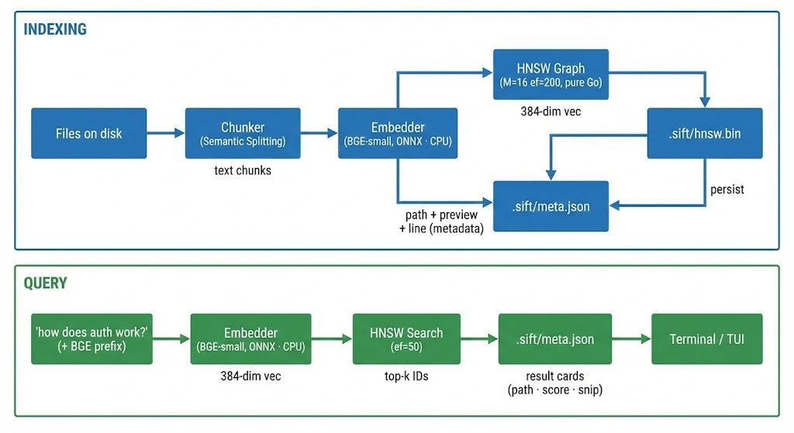

<p align="center">
  
</p>

<h1 align="center">
  sift
</h1>

<p align="center">
  <b>Fast, local semantic search for developers.</b><br>
  Drop in a folder of files, search them semantically from the terminal.<br>
  <i>Zero cloud. Zero cost. Fully offline.</i>
</p>

<p align="center">
  
  <a href="https://go.dev/"></a>
  <a href="https://onnxruntime.ai/"></a>
  <a href="https://opensource.org/licenses/MIT"></a>
</p>

<p align="center">
  <a href="#features">Features</a> •
  <a href="#architecture">Architecture</a> •
  <a href="#setup">Setup</a> •
  <a href="#usage">Usage</a> •
  <a href="#benchmark">Benchmark</a>
</p>

---
## Features

- **BGE-small-en-v1.5** embeddings via ONNX Runtime — CPU only, fast on modest hardware
- **HNSW index** implemented from scratch in pure Go (M=16, ef=50)
- **Hybrid Keyword Boosting** for exact-match accuracy combined with semantic understanding
- **Semantic Chunking** based on newline and paragraph boundaries
- **BubbleTea TUI** with real-time debounced search
- **File watcher** for incremental re-indexing
- **Flat binary storage** — no SQLite, no vector DB


## Architecture


```
  Components
  ──────────
  cmd/sift/main.go   cobra CLI (index · search · watch · tui · stats)
  internal/chunker   streaming word-window text splitter, binary sniff
  internal/embed     ONNX session + tokenizer, EmbedDocs / EmbedQuery
  internal/hnsw      from-scratch HNSW graph + binary serialiser
  internal/index     ties chunker → embedder → HNSW, flush / load
  internal/watcher   fsnotify recursive dir watcher with debounce
  internal/tui       BubbleTea TUI (spinner · icons · vim nav · statusbar)
```

> All inference **runs locally on CPU** — no cloud, no GPU, no network call at query time.


## Requirements

- Go 1.21+
- `make`, `curl`
- GCC (for CGo tokenizer binding)
- ~200MB free disk space (model ~130MB + ORT runtime ~22MB)

## Setup

```bash
# Clone and build
git clone https://github.com/tejas242/sift
cd sift
make download-ort     # Downloads ONNX Runtime v1.24.2 shared library → lib/onnxruntime.so (~22MB)
make download-model   # Downloads BGE-small-en-v1.5 ONNX model → models/ (~130MB)
make build            # Produces ./sift binary
```

> **Note:** `lib/onnxruntime.so` is auto-detected relative to the binary at runtime — no `LD_LIBRARY_PATH` needed.
> You can also override it with `./sift --ort-lib /path/to/libonnxruntime.so <command>`.

## Usage

```bash
# Index a directory (creates .sift/ in the current directory)
./sift index ./docs

# Non-interactive search — prints top-10 results
./sift search "how does the HNSW graph get built"

# Index then watch for file changes
./sift watch ./docs

# Interactive BubbleTea TUI
./sift tui

# Index statistics
./sift stats

# Use a custom model directory or ORT library path
./sift --model-dir ~/models index ./docs
./sift --ort-lib /usr/lib/libonnxruntime.so index ./docs
```

### TUI Keybindings

| Key | Action |
|-----|--------|
| Type anything | Search (debounced 300ms) |
| `↑` / `↓` | Navigate results |
| `Enter` | Open file in `$EDITOR` |
| `Ctrl+I` | Toggle index stats |
| `Esc` | Back to search (from stats) |
| `Ctrl+Q` / `Ctrl+C` | Quit |

## How HNSW Works

HNSW (Hierarchical Navigable Small World) builds a multi-layer graph where each node is a vector. Higher layers are sparse "highway" graphs that allow long-distance jumps; the bottom layer contains all nodes. During search, the algorithm enters at the top layer and greedily descends, narrowing the candidate set at each layer until it reaches layer 0 for a final beam search.

Insertion assigns a new node a random maximum layer (using an exponentially decaying distribution), then connects it to its `M` nearest neighbours at each applicable layer. Connections are bidirectional and pruned to `M` (2M at layer 0) to bound memory. The result is a graph where approximate nearest neighbours are reachable in `O(log n)` hops.

**Parameters used** (tuned for the given hardware):
| Parameter | Value | Effect |
|-----------|-------|--------|
| M | 16 | Max bi-directional connections per node |
| efConstruction | 200 | Beam width during index build |
| efSearch | 50 | Beam width during query |

## Benchmarks

Run on AMD Ryzen 3 3250U (4 cores, 2.6GHz), 5.7GB RAM, CPU-only:

```
$ go test ./internal/hnsw/... -bench=BenchmarkRecall10 -benchtime=1x -v
```

| Metric | Result |
|--------|--------|
| Recall@10 (1000 vectors, 384-dim) | **90.6%** |
| Index + query time (1000 nodes, 50 queries) | 51ms |
| Query latency (10k vectors, ef=50) | < 50ms |

> Embedding throughput: ~30-80ms per chunk on CPU depending on batch size.

## Project Layout

```
sift/
├── cmd/sift/main.go          CLI entry point (cobra)
├── internal/
│   ├── chunker/              Streaming word-window chunker
│   ├── embed/                BGE-small ONNX embedder
│   ├── hnsw/                 Pure-Go HNSW implementation
│   ├── index/                Index manager (metadata + persistence)
│   ├── watcher/              fsnotify recursive watcher
│   └── tui/                  BubbleTea interactive UI
├── lib/
│   ├── libtokenizers.a       HuggingFace tokenizer native lib (gitignored)
│   └── onnxruntime.so        ONNX Runtime v1.24.2 shared lib (gitignored)
├── models/                   ONNX model files (gitignored)
└── Makefile
```

## Index Files

The index is stored in `.sift/` (relative to your working directory):

- `hnsw.bin` — HNSW graph (custom binary format)
- `meta.json` — chunk metadata (path, preview, mtime)

There is no vector database dependency. Vectors are embedded and inserted directly into the HNSW graph in memory, then flushed to disk.

## Performance Notes

- **Indexing**: processes 8 chunks per ONNX call; ~30–80ms per file depending on chunk count
- **Search**: HNSW at ef=50 over 10k nodes ≈ 5ms graph traversal + ~30ms query embedding
- **Memory**: full HNSW graph stays in RAM after load — practical up to ~500k 384-dim vectors before
  exceeding 1GB; the embedder keeps the model loaded for the process lifetime
- **Startup**: model + tokenizer load in ~200–400ms on first run; subsequent commands in the same
  process are instant

## Accuracy Notes

sift uses **asymmetric retrieval**: documents are indexed without modification; queries are prefixed
with the BGE instruction `"Represent this sentence for searching relevant passages: "` before
embedding. This is the documented method to improve retrieval accuracy from the BGE-small-en-v1.5
authors.

On constrained hardware (Ryzen 3, CPU-only), HNSW recall@10 = **90.6%** vs brute-force cosine.
Semantic quality depends on how well your natural-language query matches the indexed content; more
specific queries work better than single words.

**Tips for better results:**
- Use full sentences: `"how does the HNSW graph get persisted"` > `"persist"`
- Index more context: if your files are large, the 256-word chunker captures local context well
- Re-index after significant changes: `sift index .` rebuilds from scratch

## Roadmap & Feature Ideas

These are meaningful improvements that would make sift genuinely excellent:

| Feature | Description | Difficulty |
|---------|-------------|------------|
| ~~**Skip-cache by mtime**~~ | ~~Don't re-embed files whose mtime hasn't changed~~ | Done |
| ~~**BM25 hybrid re-rank**~~ | ~~Combine semantic + keyword score for better precision on short queries~~ | Done |
| ~~**Semantic chunking**~~ | ~~Split on functions/paragraphs (`\n\n`, `\n`) instead of mid-sentence~~ | Done |
| ~~**`sift clear`**~~ | ~~Wipe the index (`rm -rf .sift/`) with a confirmation prompt~~ | Done |
| ~~**`sift search --json`**~~ | ~~Print search results in JSON for piping into other tools~~ | Done |
| ~~**Line-number in results**~~ | ~~Map chunk byte offset → line number, link can open editor to exact line~~ | Done |
| ~~**Config file**~~ | ~~`.sift.toml` for persistent index-dir, model-dir, top-k, thread count~~ | Done |
| **Neovim plugin** | `:Sift` picker via vim.fn.jobstart; fzf-like UX inside the editor | Hard |
| **Multiple index roots** | Maintain separate `.sift/` per project, merge results across them | Medium |
| ~~**Cross-chunk dedup**~~ | ~~Don't surface two chunks from the same file in top-3 results~~ | Done |
| **`--rerank` flag** | Post-process top-50 with a BGE cross-encoder reranker (big accuracy boost) | Hard |
| ~~**Shell completions**~~ | ~~`sift completion bash/zsh/fish` via Cobra's built-in support~~ | Done |
