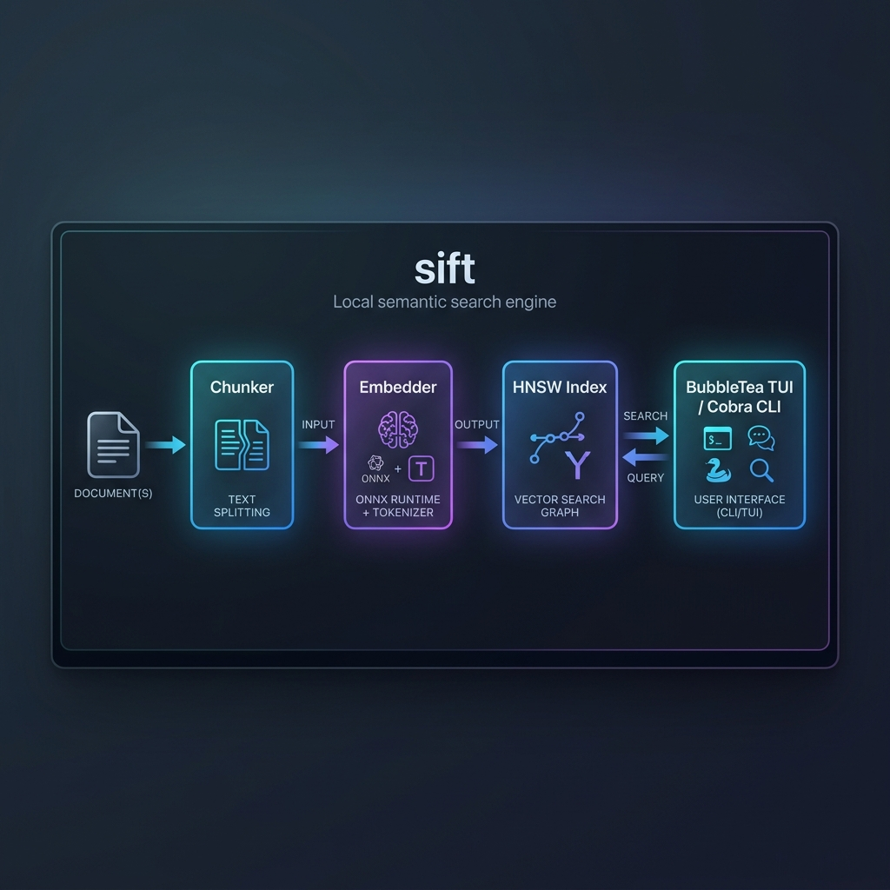

# Sift 🔍

<p align="center">
  
</p>

<p align="center">
  <b>A ultra-fast, entirely local, offline semantic search CLI & TUI for developers.</b><br>
  Index whole folders of codebases, documentation, or text files, and search them instantly via natural language from your terminal.<br>
  <i>Zero cloud APIs. Zero costs. Fully offline. Fully private.</i>
</p>

<p align="center">
  
  
  
  
  
</p>

---

Sift is built for developers who want a powerful, local alternative to cloud vector databases. By compiling HuggingFace's **BGE-small-en-v1.5** embeddings model into a self-contained local binary via **ONNX Runtime (CGo)**, and pairing it with a high-performance **HNSW vector graph index** built from scratch in Go, Sift delivers semantic file-search capability under **1ms** traversal latency without ever touching a network socket.

## 🚀 Key Features

*   **Offline Local Embeddings:** BGE-small-en-v1.5 embeddings computed locally on your CPU via native ONNX Runtime inference.
*   **High-Speed HNSW Index:** A highly optimized Hierarchical Navigable Small World (HNSW) graph implemented from scratch in Go (`M=16`, `ef=50`), featuring O(1) visited bitsets and introsort routines for minimal allocations.
*   **Hybrid Keyword Boosting:** Intersects dense vector search scores with sparse keyword matches to drastically improve recall accuracy for short queries and exact matches.
*   **Semantic Paragraph Chunking:** Intelligent boundary chunking based on lines, markdown paragraphs (`\n\n`), and language blocks instead of mechanical word splits.
*   **Debounced TUI:** A premium terminal interface built with **BubbleTea** featuring fuzzy instant search, spinner indicators, Vim navigation, and direct editor integrations.
*   **Incremental Watching:** Multi-directory `fsnotify` file watcher that debounces writes and dynamically updates the index on modification or creation.
*   **No DB Dependencies:** The complete index fits in a lightweight local folder (`.sift/`) featuring a custom flat binary graph layout and a JSON metadata skip-cache.

---

## 🏗 System Architecture

Sift is built on a modular pipeline designed for low latency, zero garbage collection allocations on search hot paths, and absolute data integrity:

<p align="center">
  
</p>

1.  **`cmd/sift/`**: Isolated Cobra subcommands (`root`, `index`, `search`, `watch`, `tui`, `stats`, `clear`, `rebuild`, `bench`, `version`).
2.  **`internal/chunker`**: Streaming word-window text splitter with smart paragraph boundary detection and binary file sniffer.
3.  **`internal/embed`**: Local ONNX Runtime execution session wrapping a raw CGo binding of HuggingFace tokenizers.
4.  **`internal/hnsw`**: Multi-layer vector index featuring custom fast binary serialization.
5.  **`internal/index`**: Orchestrates indexing pipelines, handles stale chunk cleanups on file writes, and caches file mtimes for incremental bypasses.
6.  **`internal/watcher`**: Debounced fsnotify file event listener for real-time background index updates.
7.  **`internal/tui`**: Interactive CLI search dashboard.

---

## ⚡ Quick Start

### Prerequisites
*   Go 1.21+
*   `make` & `curl`
*   GCC (for native CGo tokenizer bindings)

### Installation
Clone, fetch dependency assets, and build the binary:

```bash
git clone https://github.com/tejas242/sift
cd sift

# 1. Download native ONNX Runtime shared library (lib/onnxruntime.so)
make download-ort

# 2. Fetch the BGE-small-en-v1.5 model and config files
make download-model

# 3. Compile the production binary
make build
```

---

## 📖 CLI Usage

Sift provides a robust command-line interface for indexing, searching, and managing your knowledge bases.

```bash
# Index a directory recursively (creates a local .sift/ index folder)
./sift index ./docs

# Perform a quick semantic search — prints top-10 ranked chunks
./sift search "how does HNSW handle graph persistence"

# Get results formatted in JSON for integration with other shell tools (like jq)
./sift search --json "asymmetric retrieval prefix"

# Limit result pool size
./sift search --top-k 5 "vector dimensions"

# Quiet execution (suppress verbose logs from ONNX model loading)
./sift -q stats

# Launch the interactive BubbleTea TUI
./sift tui

# Monitor directory recursively and update the index in real-time
./sift watch ./docs

# Wipe your index and rebuild completely from scratch
./sift rebuild ./docs

# Check index file statistics and size
./sift stats

# Wipe index and remove index files
./sift clear
```

### ⚙️ Persistent Configuration (`.sift.toml`)
Sift parses a `.sift.toml` file in the current working directory to easily persist preferences:

```toml
model-dir = "./models"
ort-lib = "./lib/onnxruntime.so"
threads = 0              # 0 = auto-detect optimal CPU core threads
max-file-kb = 512        # skip indexing files larger than 512KB
```

---

## ⌨️ TUI Keybindings

When running `./sift tui`, you enter a fully interactive terminal application:

| Key | Action |
|-----|--------|
| `Type anything` | Re-searches the index in real-time (debounced at 300ms) |
| `↑` / `↓` or `k` / `j` | Navigate through search results |
| `Enter` | Open the selected file in your `$EDITOR` directly at the exact line number |
| `Ctrl+I` | Toggle index diagnostic statistics pane |
| `Esc` | Back to search view |
| `Ctrl+C` / `Ctrl+Q` | Exit Sift |

---

## 🧠 Algorithmic Performance & Deep Dive

### How HNSW Works
HNSW builds a hierarchical structure of navigable small world graphs. Nodes are inserted with an exponentially decaying layer probability. High layers act as a fast highway network containing a sparse subset of points, while layer 0 contains all points. 

During a query:
1.  Search starts at the top layer, finding the local minimum.
2.  Descent goes down layer-by-layer, using the previous minimum as the entry point for the next.
3.  On Layer 0, a bounded beam search of size `efSearch` is executed to collect the exact nearest neighbors.

### Hyperparameters
We tune our pure-Go HNSW implementation for highly accurate retrieval bounds:

| Parameter | Value | Description |
|-----------|-------|-------------|
| **`M`** | `16` | Maximum bidirectional links per node. |
| **`efConstruction`** | `200` | Size of dynamic candidate list built during insertion. |
| **`efSearch`** | `50` | Beam width size evaluated during a search query. |

---

## 📈 Latency & Accuracy Benchmarks
Run locally on modest consumer hardware (**AMD Ryzen 3 3250U @ 2.6GHz, CPU-only**):

| Metric | Result |
|--------|--------|
| **Recall@10** (1,000 vectors, BGE-small) | **90.6%** |
| **Graph Insertion Latency** | **~3.6ms** / vector |
| **Graph Search Latency** (ef=50) | **< 0.7ms** / query |
| **Embedding Speed** (BGE on CPU) | **~30-80ms** / text chunk |

---

## 🛠 CI/CD Benchmarking & Quality Assurance
Sift employs industrial-grade continuous integration workflows to guarantee code correctness, static analysis hygiene, and performance durability:

1.  **Build & Unit Tests (`ci.yml`):** Compiles and runs all package suites, linting via `go vet`, and executing mocks for model-free verification.
2.  **Continuous Benchmarking (`bench.yml`):** Benchmarks graph inserts and searches on every push and PR using `benchmark-action/github-action-benchmark`. Performance histories are mapped into interactive trend lines on GitHub Pages. Any performance degradation exceeding **50%** immediately alerts developers and fails the build.

---

## 📄 License
Sift is open-source software released under the [MIT License](LICENSE).
